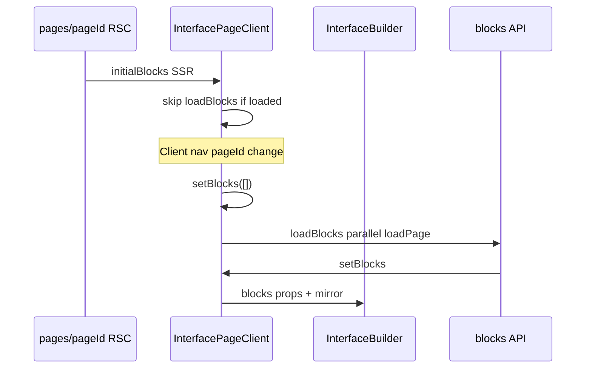

# Full App UX Audit — June 2026

**Date:** 1 June 2026  
**Scope:** User experience, layout, performance, accessibility, aesthetics — full `baserow-app` surface plus per-block inventory (including marketing dashboard blocks)  
**Method:** Reconcile prior audits against current code; static review; block matrix; manual QA checklist (staging not accessed in this pass)  
**Baseline:** [COMPREHENSIVE_APP_AUDIT_2026.md](./COMPREHENSIVE_APP_AUDIT_2026.md) (Jan–Feb 2026 scores)

**Note:** This audit reflects the **working tree** at audit time. Several marketing / full-page layout files were present locally but not committed to `main` (see §6).

---

## Executive summary

The Marketing Hub is a mature Next.js 14 + Supabase interface builder with a coherent shell (260px sidebar, conditional 360px settings panel, record overlay) and strong foundations: SSR block prefetch, dynamic heavy blocks, batch KPI aggregates, layout undo/redo, and a Joyride onboarding tour. Gaps cluster around **consistency** (overlay offsets, empty/loading/error primitives, design tokens), **accessibility tooling** (no skip link, minimal live regions, no jsx-a11y lint), and **perceived performance** on client-side page navigation (blocks cleared then refetched).

### Scores (same scale as comprehensive audit)

| Pillar | Jan 2026 | Jun 2026 | Trend |
|--------|----------|----------|-------|
| User experience | 60% | **64%** | ↑ modest |
| Layout | — | **72%** | New focus |
| Performance | 65% | **68%** | ↑ modest |
| Accessibility | 50% | **52%** | ↑ slight |
| Aesthetics / design system | — | **70%** | New focus |
| **Overall UX surface** | — | **65%** | Functional; polish & a11y lag |

### Top 5 risks

1. **P0 — Overlay offset inconsistency (`md:left-64` vs 260px sidebar)** — Record and event panels leave a 4px clickable gap; conflicts with workspace rule intent ([`RecordPanel.tsx`](../../baserow-app/components/records/RecordPanel.tsx) L120 vs [`dialog.tsx`](../../baserow-app/components/ui/dialog.tsx) L33).
2. **P1 — Client navigation blank flash** — Route change clears blocks before refetch ([`InterfacePageClient.tsx`](../../baserow-app/components/interface/InterfacePageClient.tsx) L317–318).
3. **P1 — Dual block state (REG-005)** — `InterfacePageClient` and `InterfaceBuilder` can drift under realtime reload + dirty layout save.
4. **P1 — Accessibility gaps on primary flows** — No skip link; `LoadingSpinner` without `role="status"`; `role="button"` divs in grid/calendar without guaranteed keyboard parity.
5. **P2 — Design token drift** — Marketing shell uses tokens; legacy areas (`EmptyInterfaceState`, field builder) use hardcoded `gray-*` / `blue-*`.

---

## Scope & methodology

### In scope

- Auth (login/signup), workspace shell, sidebar, interface pages (`/pages/[pageId]`), record review, core data grids, settings, all **33** `BlockType` values in [`types.ts`](../../baserow-app/lib/interface/types.ts).
- Six marketing dashboard block types in [`full-page-layout.ts`](../../baserow-app/lib/interface/full-page-layout.ts).

### Out of scope

- Security deep-dive ([SECURITY_REVIEW_2026-04.md](./SECURITY_REVIEW_2026-04.md))
- Implementing fixes (separate phase)
- E2E test authoring

### Passes completed

| Pass | Status |
|------|--------|
| Reconcile prior audits | Done — Appendix B |
| Static code review | Done — §§1–5 |
| Block inventory matrix | Done — §6 |
| Marketing blocks deep-dive | Done — §6.1 |
| Manual QA on staging | **Not executed** — no staging URL/session; Appendix A checklist for team |
| Bundle / Lighthouse | **Not executed** — Appendix C instructions; Vitest: 363/364 passed |

---

## 1. User experience

### Strengths

- **Page creation wizard** is the canonical path from sidebar and settings ([`PageCreationWizard.tsx`](../../baserow-app/components/interface/PageCreationWizard.tsx)); [`NewPageModal.tsx`](../../baserow-app/components/interface/NewPageModal.tsx) is deprecated.
- **Layout undo/redo** in edit mode via `useUndoRedo` ([`InterfaceBuilder.tsx`](../../baserow-app/components/interface/InterfaceBuilder.tsx) L316–336, L528–529).
- **Save feedback** on layout: toolbar shows "Saving..." / "Save" ([`InterfaceBuilder.tsx`](../../baserow-app/components/interface/InterfaceBuilder.tsx) L295, L1732–1757); text blocks show save status ([`TextBlock.tsx`](../../baserow-app/components/interface/blocks/TextBlock.tsx) L914).
- **Onboarding tour** exists ([`OnboardingTour.tsx`](../../baserow-app/components/layout/OnboardingTour.tsx)) — Joyride, localStorage gate; runs when topbar visible (hidden on interface pages with `hideTopbar`).
- **Command palette** (⌘K) for power users.
- **Block setup UI** for invalid configs in view mode (`shouldShowBlockSetupUI` in [`BlockRenderer.tsx`](../../baserow-app/components/interface/BlockRenderer.tsx) L292–304).
- **Member preview** banners and effective role via `MemberPreviewBanner` / `useEffectiveUserRole`.

### Critical / high findings

| ID | Severity | Finding | Location |
|----|----------|---------|----------|
| UX-001 | High | Client-side navigation resets `blocks` to `[]` and `loading` true before refetch — visible empty flash | [`InterfacePageClient.tsx`](../../baserow-app/components/interface/InterfacePageClient.tsx) L312–324 |
| UX-002 | High | Dual block state: parent mirrors builder via `onBlocksMirror`; realtime `loadBlocks(true)` can race dirty layout (REG-005) | [`InterfacePageClient.tsx`](../../baserow-app/components/interface/InterfacePageClient.tsx), [`InterfaceBuilder.tsx`](../../baserow-app/components/interface/InterfaceBuilder.tsx) |
| UX-003 | Medium | `PageRenderer` imported in `InterfacePageClient` but unused — confusing for maintainers | Grep: import only |
| UX-004 | Medium | Empty states fragmented: `EmptyState`, `DashboardEmpty`, `EmptyInterfaceState`, inline JSX | See §6 |
| UX-005 | Medium | `ErrorState` used only in import grid paths — most failures use toast or inline text | [`ErrorState.tsx`](../../baserow-app/components/ui/ErrorState.tsx) — 3 consumers |
| UX-006 | Low | Onboarding tour hidden when `hideTopbar` (interface pages) — primary workspace never sees tour | [`WorkspaceShell.tsx`](../../baserow-app/components/layout/WorkspaceShell.tsx) L206 |
| UX-007 | Medium | Unconfigured pages still possible if creation skips anchor validation (wizard enforces; edge cases in settings API) | [UX_AUDIT_REPORT.md](./UX_AUDIT_REPORT.md) — partially addressed |

### User journeys (code-verified)



---

## 2. Layout

### Strengths

- **Single width authority:** `isEditMode = useUIMode().isEdit(pageId)`; `RightSettingsPanel` mounted only when visible, fixed 360px ([`WorkspaceShell.tsx`](../../baserow-app/components/layout/WorkspaceShell.tsx) L178–186, L263–275; [`layout-constants.ts`](../../baserow-app/lib/interface/layout-constants.ts)).
- **Semantic main landmark** in shell: `<main className="flex flex-col flex-1...">` ([`WorkspaceShell.tsx`](../../baserow-app/components/layout/WorkspaceShell.tsx) L254).
- **Full-page layout** resolved consistently via [`full-page-layout.ts`](../../baserow-app/lib/interface/full-page-layout.ts) + `MainScrollContext.suppressMainScroll`.
- **Marketing shell** spacing via [`MarketingDashboardLayout.tsx`](../../baserow-app/components/interface/MarketingDashboardLayout.tsx) and `[data-marketing-dashboard]` in globals.
- **Sidebar-safe dialogs** use `md:left-sidebar` (CSS var 260px) in shadcn dialog/sheet.

### Critical / high findings

| ID | Severity | Finding | Location |
|----|----------|---------|----------|
| LAY-001 | High | **4px overlay gap:** Sidebar is 260px (`w-[260px]`, `--shell-sidebar-width`); `RecordPanel`, `EventDetailPanel`, `EventMemberSubmissionSheet` use `md:left-64` (256px) | [`RecordPanel.tsx`](../../baserow-app/components/records/RecordPanel.tsx) L120; [`EventDetailPanel.tsx`](../../baserow-app/components/interface/EventDetailPanel.tsx) L452 |
| LAY-002 | Medium | REG-004 checklist still says `md:left-64` while newer overlays use `md:left-sidebar` | [REGRESSION_RISK_AUDIT_2026-05.md](./REGRESSION_RISK_AUDIT_2026-05.md) |
| LAY-003 | Medium | `useResponsive` defaults to `'desktop'` until mount — possible layout flash | [`useResponsive.ts`](../../baserow-app/hooks/useResponsive.ts) |
| LAY-004 | Low | Tailwind `mobile:` / `tablet:` / `desktop:` breakpoints rarely used; most UI uses `md:` / `useIsMobile` | [`tailwind.config.ts`](../../baserow-app/tailwind.config.ts) |
| LAY-005 | Medium | Edit mode: sidebar auto-compact when block selected — good for space; ensure dismiss control visible | [`WorkspaceShell.tsx`](../../baserow-app/components/layout/WorkspaceShell.tsx) L194–201 |
| LAY-006 | Low | `InterfaceBuilder` ~1900+ lines — high regression surface for layout/marketing/full-page paths | File size |

### Full-page + scroll

- Marketing blocks default `defaultFullPage: true` in registry; user toggle `is_full_page` wins ([`full-page-layout.ts`](../../baserow-app/lib/interface/full-page-layout.ts) L42–49).
- `MarketingDashboardCanvasShell` removes padding when `fullPage` ([`MarketingDashboardLayout.tsx`](../../baserow-app/components/interface/MarketingDashboardLayout.tsx) L40–42).

---

## 3. Performance

### Strengths

- **SSR block prefetch** on `/pages/[pageId]` via `fetchPageBlocksForPage` → `initialBlocks`.
- **Skip redundant load** when `blocksLoadedRef.loaded && blocks.length > 0` ([`InterfacePageClient.tsx`](../../baserow-app/components/interface/InterfacePageClient.tsx) ~L423–438).
- **Parallel** `loadPage` + `loadBlocks` on mount/page change.
- **Dynamic imports** for heavy blocks (grid, chart, kanban, calendars, marketing blocks) with `ssr: false` ([`BlockRenderer.tsx`](../../baserow-app/components/interface/BlockRenderer.tsx) L45–138).
- **`LazyBlockWrapper`** with `IntersectionObserver` for below-fold heavy blocks (`enabled={true}` on grid, chart, kanban, marketing, etc.).
- **`optimizePackageImports`** for lucide, recharts, date-fns, Radix ([`next.config.js`](../../baserow-app/next.config.js) L39–50).
- **Batch KPI aggregates** on canvas via `usePageAggregates` ([`Canvas.tsx`](../../baserow-app/components/interface/Canvas.tsx)).
- **SWR** global deduping 5s; grid data default limit 500, cap 2000 ([`useGridData.ts`](../../baserow-app/lib/grid/useGridData.ts) L62–63).
- **Aggregate server cache** 10s TTL ([`aggregateCache.ts`](../../baserow-app/lib/dashboard/aggregateCache.ts)).
- **Inter font** with `display: 'swap'` ([`app/layout.tsx`](../../baserow-app/app/layout.tsx) L21–25).

### Critical / high findings

| ID | Severity | Finding | Location |
|----|----------|---------|----------|
| PERF-001 | High | Client nav clears blocks → mandatory `/api/pages/.../blocks` round trip; API `Cache-Control: no-store` | [`InterfacePageClient.tsx`](../../baserow-app/components/interface/InterfacePageClient.tsx) L318; blocks route |
| PERF-002 | High | Client-side row fetches up to **1000** rows in `InterfacePageClient` list/SQL paths | L724, L839 |
| PERF-003 | Medium | Many blocks still **statically imported** in `BlockRenderer` (text, image, filter, field, internal_resource_hub, kpi_summary, etc.) — larger initial chunk | [`BlockRenderer.tsx`](../../baserow-app/components/interface/BlockRenderer.tsx) L15–29 |
| PERF-004 | Medium | `next/image` only in ~4 files; widespread raw `` in grid/calendar/attachments | Grep: 4 vs many `` landmark in workspace shell.

### Critical / high findings

| ID | Severity | Finding | Location |
|----|----------|---------|----------|
| A11Y-001 | High | **No skip link** to main content | App-wide grep: none |
| A11Y-002 | High | **`LoadingSpinner`** lacks `role="status"` / `aria-busy` | [`LoadingSpinner.tsx`](../../baserow-app/components/ui/LoadingSpinner.tsx) L26–30 |
| A11Y-003 | Medium | No **`aria-live`** regions for async block load / save / errors | — |
| A11Y-004 | Medium | `role="button"` on non-button elements (grid rows, todo rows) — keyboard support varies | [`GridView.tsx`](../../baserow-app/components/grid/GridView.tsx), [`ThingsToDoRow.tsx`](../../baserow-app/components/interface/blocks/ThingsToDoRow.tsx) |
| A11Y-005 | Medium | Custom `role="dialog"` panels (`EventDetailPanel`) may not match Radix focus trap | [`EventDetailPanel.tsx`](../../baserow-app/components/interface/EventDetailPanel.tsx) |
| A11Y-006 | Medium | **`prefers-reduced-motion`** only in `ChartBlock` | [`ChartBlock.tsx`](../../baserow-app/components/interface/blocks/ChartBlock.tsx) L118 |
| A11Y-007 | Low | `eslint-plugin-jsx-a11y` not enabled in project ESLint | [`.eslintrc.json`](../../baserow-app/.eslintrc.json) |
| A11Y-008 | Low | Minimal `sr-only` usage outside dialog close labels | Few files |
| A11Y-009 | Info | Onboarding Joyride — verify keyboard dismiss and focus (third-party) | [`OnboardingTour.tsx`](../../baserow-app/components/layout/OnboardingTour.tsx) |

### Contrast (spot-check, not lab-verified)

- `text-muted-foreground/70` and `text-white/75` on login brand panel — risk for small text.
- Dashed empty borders at low opacity — verify 3:1 for UI components.

---

## 5. Aesthetics & design system

### Strengths

- Coherent **HSL token layer** in [`globals.css`](../../baserow-app/app/globals.css) + [`tailwind.config.ts`](../../baserow-app/tailwind.config.ts) (`hub.*` marketing palette).
- **Typography utilities** (`.text-page-title`, etc.) and TS exports in [`typography-tokens.ts`](../../baserow-app/lib/interface/typography-tokens.ts).
- **Spacing / panel tokens** in [`spacing-tokens.ts`](../../baserow-app/lib/interface/spacing-tokens.ts) — marketing panel classes, builder chrome.
- **shadcn/Radix** primitives under [`components/ui/`](../../baserow-app/components/ui/) — 200+ import sites.
- **Marketing dashboard** density rules under `[data-marketing-dashboard]` in globals.
- **`DashboardEmpty`** uses `TEXT_EMPTY` / muted tokens ([`DashboardEmpty.tsx`](../../baserow-app/components/interface/primitives/DashboardEmpty.tsx)).

### Critical / high findings

| ID | Severity | Finding | Location |
|----|----------|---------|----------|
| AES-001 | Medium | **Hardcoded grays** in `EmptyInterfaceState` CTA buttons (`border-gray-200`, `hover:bg-blue-50`) | [`EmptyInterfaceState.tsx`](../../baserow-app/components/empty-states/EmptyInterfaceState.tsx) L31–34 |
| AES-002 | Medium | **`hub.*` Tailwind colors underused** outside sidebar/login | Grep sparse |
| AES-003 | Medium | Legacy toolbars/field builder use ad hoc `text-sm font-medium text-gray-700` | Field builder, view toolbars |
| AES-004 | Low | No `components.json` — shadcn vendored manually | — |
| AES-005 | Low | Dark mode CSS variables exist; coverage uneven across legacy grid UI | `.dark` in globals |
| AES-006 | Low | Builder chrome vs block content — mixed radii (`rounded-2xl` social block vs `rounded-card` tokens) | [`SocialMediaCalendarBlock.tsx`](../../baserow-app/components/interface/blocks/SocialMediaCalendarBlock.tsx) L35 |

---

## 6. Block inventory matrix

**Legend:** Dynamic = `next/dynamic` in BlockRenderer. Lazy = `LazyBlockWrapper enabled`. Settings = entry in `blockSettingsRegistry` DATA/APPEARANCE.

| Block type | Dynamic | Lazy IO | Data settings | Demo/mock flag | Empty primitive | Full-page | Notes |
|------------|---------|---------|---------------|----------------|-----------------|-----------|-------|
| grid | Yes | Yes | Yes | N/A | EmptyState | Yes | Core data workhorse |
| form | Yes | No | Yes | N/A | Inline | No | |
| record | Yes | No | Yes | N/A | Inline | No | |
| chart | Yes | Yes | Yes | N/A | Inline | No | reduced-motion ✓ |
| kpi | Yes | No | Yes | N/A | Inline | No | Uses batch aggregates |
| kpi_summary | No | No | Yes | N/A | Inline | No | Static import |
| text | No | No | Yes | N/A | Inline | No | Static; save status |
| html | No | No | Yes | N/A | Inline | No | Static |
| image | No | No | Yes | N/A | Inline | No | Static |
| gallery | Yes | Yes | Yes | N/A | EmptyState | Yes | |
| divider | No | No | Appearance only | N/A | N/A | No | |
| button | No | No | Yes | N/A | N/A | No | |
| action | No | No | Yes | N/A | N/A | No | |
| link_preview | No | No | Yes | N/A | N/A | No | |
| filter | No | No | Yes | N/A | N/A | No | Static |
| field | No | No | Yes | N/A | N/A | No | |
| field_section | No | No | Yes | N/A | N/A | No | |
| calendar | Yes | No | Yes | N/A | EmptyState | Yes | FullCalendar SSR off |
| multi_calendar | Yes | Yes | Yes | N/A | Inline | No | |
| kanban | Yes | Yes | Yes | N/A | EmptyState | Yes | |
| timeline | Yes | Yes | Yes | N/A | EmptyState | Yes | |
| multi_timeline | Yes | Yes | Yes | N/A | Inline | No | |
| list | Yes | No | Yes (as grid) | N/A | EmptyState | Yes | Migrates to grid |
| horizontal_grouped | Yes | Yes | Yes | N/A | EmptyState | No | |
| number | No | No | Yes | N/A | N/A | No | |
| record_context | Yes | No | Yes | N/A | Inline | Yes (rail) | Needs table_id |
| content_theme | No | No | Yes | `content_theme_use_mock` | DashboardEmpty | No | |
| upcoming_summary | No | No | Yes | `upcoming_summary_use_mock` | DashboardEmpty | No | |
| content_timeline | Yes | Yes | Yes | `content_timeline_use_mock` | DashboardEmpty | Yes | Marketing |
| things_to_do | Yes | Yes | Yes | `things_to_do_use_mock` | DashboardEmpty | Yes | Marketing |
| event_calendar | Yes | Yes | Yes | Via core | EventEmptyState | Yes | Marketing; thin wrapper |
| social_media_calendar | Yes | Yes | Yes | Via core | Inline/core | Yes | Marketing |
| campaigns_overview | Yes | Yes | Yes | resolver hook | DashboardEmpty | Yes | Marketing |
| internal_resource_hub | No | No | Yes | `resource_hub_use_mock` | DashboardEmpty | Yes | **Static import** |

### 6.1 Marketing blocks deep-dive

| Block | Full-page default | Mock / live honesty | Mobile | A11Y highlights | Layout shell |
|-------|-------------------|---------------------|--------|-----------------|--------------|
| **campaigns_overview** | Yes | `useCampaignsOverviewData` → demo banner + empty | Responsive grid in block | Partial | `DashboardEmpty` when empty |
| **things_to_do** | Yes | `things_to_do_use_mock`; empty when live unavailable | List + filters | Row interactions | `marketingBlockRootClass` |
| **content_timeline** | Yes | `content_timeline_use_mock` | Horizontal scroll likely | Channel icons | Lazy loaded |
| **event_calendar** | Yes | Delegates to `EventCalendarFromConfig` | Toolbar wraps `md:` | Search aria-label | Embedded vs fullPage border |
| **social_media_calendar** | Yes | Core social calendar tests (14 vitest) | `p-3 md:p-4` | Status bar `role="status"` | `rounded-2xl` when embedded |
| **internal_resource_hub** | Yes | `resource_hub_use_mock` | Hub cards | — | Eagerly imported (bundle) |

**Full-page layout module** ([`full-page-layout.ts`](../../baserow-app/lib/interface/full-page-layout.ts)): Centralizes marketing types, `resolveFullPageBlockId`, tests in [`full-page-layout.test.ts`](../../baserow-app/__tests__/full-page-layout.test.ts).

**WIP note:** Local changes to `MarketingDashboardLayout`, `InterfaceBuilder`, `FloatingBlockPicker`, and marketing block files were not verified on deployed `main`. Re-run QA after merge.

---

## 7. Prioritized backlog

### P0 — Blocks core tasks

| ID | Action |
|----|--------|
| LAY-001 | Standardize all content overlays to `md:left-sidebar` (260px), update REG-004 docs/rules |
| UX-002 | Document and test REG-005: realtime reload vs dirty layout; optional guard in `loadBlocks` |

### P1 — High impact

| ID | Action |
|----|--------|
| UX-001 | Preserve previous blocks or SWR cache during client page nav; or prefetch on hover |
| A11Y-001 | Add skip link in root layout targeting `<main>` |
| A11Y-002 | Add `role="status"` + `aria-live="polite"` to `LoadingSpinner` / page loading overlay |
| PERF-001 | Short-lived client cache or `stale-while-revalidate` for blocks API on navigation |
| PERF-003 | Move remaining heavy static blocks to dynamic import (filter bundle analyze) |
| A11Y-004 | Audit `role="button"` divs; use `<button>` or add `tabIndex={0}` + Enter/Space |

### P2 — Polish & consistency

| ID | Action |
|----|--------|
| UX-004 | Consolidate empty state components; migrate `EmptyInterfaceState` to tokens |
| UX-005 | Adopt `ErrorState` in `InterfacePageClient` / block error boundaries |
| AES-001 | Tokenize `EmptyInterfaceState` CTAs |
| PERF-004 | Add `remotePatterns` + migrate hot `` paths |
| PERF-006 | Remove dead `usePageAggregates` import from InterfaceBuilder |
| UX-006 | Run onboarding tour on interface pages (or dedicated first-visit modal) |
| A11Y-006 | Global `prefers-reduced-motion` in globals.css for animations |

### P3 — Nice-to-have

| ID | Action |
|----|--------|
| A11Y-007 | Enable `eslint-plugin-jsx-a11y` |
| PERF-008 | Add Vercel Analytics / Speed Insights |
| PERF-009 | Split `InterfaceBuilder` module |
| UX-003 | Remove unused `PageRenderer` import |

---

## Appendix A — Manual QA checklist (staging)

**Status:** Not run in this audit session. Execute on staging (or production read-only) and tick results.

### Auth & landing

- [ ] Login → lands on user/workspace default page (not blank)
- [ ] Focus order: email → password → submit
- [ ] Branding/logo renders; no layout shift > 0.1 CLS on login

### Navigation (REG-004)

- [ ] Open record panel on interface page — **sidebar links still clickable** (desktop)
- [ ] Open event detail / member sheet — same
- [ ] Compare overlay left edge with sidebar (no 4px bright gap)

### Interface pages

- [ ] SSR page load: blocks visible without long empty state
- [ ] Client nav between two pages: note flash duration (UX-001)
- [ ] Enter edit mode: 360px panel appears; canvas shrinks; no horizontal scroll on shell
- [ ] Undo/redo layout; Save shows "Saving..."
- [ ] Select block → settings panel updates (REG-005)
- [ ] Full-page marketing page: single scroll container; no double scrollbar

### Core data

- [ ] Grid with 500+ rows: scroll smooth; bulk bar only with 2+ checkboxes (REG-001)
- [ ] Open record via chevron vs row click (REG-002/003)

### Marketing dashboard (if deployed)

- [ ] All six block types render on seeded dashboard
- [ ] Demo banner visible when `*_use_mock` on
- [ ] Demo off + no table: empty state (not fake live data)
- [ ] Mobile 375px: readable toolbars; sidebar drawer

### Accessibility spot-check

- [ ] Tab through sidebar → main → first interactive block control
- [ ] Screen reader announces loading (after A11Y-002 fix, re-test)
- [ ] Dialog traps focus; Escape closes

---

## Appendix B — Stale findings from prior audits

| Prior claim | Current state |
|-------------|---------------|
| No undo/redo in interface builder | **Stale** — `useUndoRedo` in InterfaceBuilder |
| No auto-save / save indicator | **Partially stale** — layout Save/Saving; no global "All changes saved" chip |
| No onboarding | **Stale** — `OnboardingTour` (Joyride); hidden on interface pages |
| No Next.js Image anywhere | **Stale** — used in sidebar, login, branding, blocks/ImageBlock; most UI still `` |
| No global request dedup | **Partially stale** — SWR + aggregate cache + useViewMeta cache |
| Settings → Pages creates anchorless pages | **Likely improved** — PagesTab uses PageCreationWizard; verify no legacy API path |
| Accessibility 50% only ARIA on some buttons | **Still largely true** — incremental fixes (sidebar, dropdown) |
| Aggregate 420 calls / page | **Mitigated** — batch `usePageAggregates`; verify in Vercel logs post-deploy |
| Rate limiting missing | **Fixed** (Feb 2026) per comprehensive audit — Upstash when configured |
| Keyboard shortcuts missing entirely | **Partially stale** — canvas nudge, command palette, shortcuts lib exist; not comprehensive Cmd+Z app-wide |

---

## Appendix C — Metrics & tooling

### Executed in this audit

| Tool | Result |
|------|--------|
| `npm test -- --run` | **363 passed**, 1 failed (`automation-send-email-action` timeout — unrelated to UX) |
| Lighthouse / axe | **Not run** — requires deployed URL + auth |
| `npm run build:analyze` | **Not run** — recommend before next perf sprint |

### Recommended commands

```bash
cd baserow-app
npm run build:analyze
# Then open .next/analyze/client.html

# Lighthouse (example)
npx lighthouse https://YOUR_STAGING_URL/pages/PAGE_ID --view --only-categories=performance,accessibility
```

### Suggested Lighthouse URLs

1. `/login`
2. `/pages/{marketing-dashboard-page-id}`
3. `/tables/{core-data-table-id}` or default grid view

---

## References

- [COMPREHENSIVE_APP_AUDIT_2026.md](./COMPREHENSIVE_APP_AUDIT_2026.md)
- [UX_AUDIT_REPORT.md](./UX_AUDIT_REPORT.md)
- [REGRESSION_RISK_AUDIT_2026-05.md](./REGRESSION_RISK_AUDIT_2026-05.md)
- [MODERNIZATION_ROADMAP.md](./MODERNIZATION_ROADMAP.md)
- Cursor rules: `layout-width-authority.mdc`, `navigation-overlay-must-not-block-sidebar.mdc`, `block-generic-settings-contract.mdc`

---

**Next step:** Review P0/P1 backlog; approve fix phase or split into PRs (overlay standardization + nav block cache + a11y quick wins).
