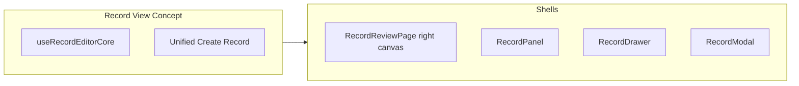

# Product Model Consolidation Audit (Decision Document)

**Scope:** Analysis and decision documentation only. No code changes, no removal of page types, no hiding of UI options, no data migration.

**Context:** Record editor behaviour is unified via `useRecordEditorCore` ([record-editor-core.ts](../baserow-app/lib/interface/record-editor-core.ts)); create-record flow is unified; fields, filters, permissions, and appearance are aligned. Blocks already render record data and open the record editor (RecordModal, panel, drawer).

---

## 1. Page Types — Current State and Where Used

### 1.1 Canonical page types (code)

Defined in [page-types.ts](../baserow-app/lib/interface/page-types.ts):

| Page type         | Label         | Where defined / used                                                                                 |
| ----------------- | ------------- | ---------------------------------------------------------------------------------------------------- |
| **content**       | Content Page  | Generic canvas; no inherent data context.                                                            |
| **record_view**   | Record View   | Canvas + injected recordId; blocks opt-in to record context; **legacy** in comments.                 |
| **record_review** | Record Review | Fixed left column (record selector) + right canvas (blocks); record selection is ephemeral UI state. |

**Where they are used:**

- **content:** [PageCreationWizard](../baserow-app/components/interface/PageCreationWizard.tsx) (purpose "Content Page"), [InterfacePageClient](../baserow-app/components/interface/InterfacePageClient.tsx) (renders `InterfaceBuilder` directly), [PageSetupState](../baserow-app/components/interface/PageSetupState.tsx), [predeploy-check](../baserow-app/scripts/predeploy-check.ts) (skips anchor check).
- **record_view:** PageCreationWizard (purpose "Record Review" actually sets `page_type: 'record_view'`), InterfacePageClient (uses `RecordReviewPage`), RecordReviewLeftColumn/InterfacePageSettingsDrawer (simplified 3-field left panel config), page-config defaults (`record_panel: 'none'`).
- **record_review:** InterfacePageClient (same layout as record_view via `useRecordReviewLayout`), RecordReviewLeftColumn (full field list left panel), InterfacePageSettingsDrawer (full left panel settings), predeploy-check (requires `base_table`), [app/pages/[pageId]/page.tsx](../baserow-app/app/pages/[pageId]/page.tsx) (`hideRecordPanel`), PageDisplaySettingsPanel (group-by, record preview).

**Legacy / DB-only page types (referenced in scripts/docs, not in wizard):**  
[predeploy-check.ts](../baserow-app/scripts/predeploy-check.ts) treats `calendar`, `list`, `record_review` as requiring `base_table`. So the DB may contain `calendar`, `list`, `dashboard`, `overview` from older behaviour; the **creation UI** only offers Content and Record Review (stored as `content` or `record_view`).

### 1.2 Per–page type: problem, solvability by blocks, shell vs data

| Page type         | Problem it solves                                                                                                      | Solvable by blocks?                                                                                                                                                                                                                                                                                                                                  | Shell vs data                                                                                                                                                      |
| ----------------- | ---------------------------------------------------------------------------------------------------------------------- | ---------------------------------------------------------------------------------------------------------------------------------------------------------------------------------------------------------------------------------------------------------------------------------------------------------------------------------------------------- | ------------------------------------------------------------------------------------------------------------------------------------------------------------------ |
| **content**       | Free-form canvas: docs, links, mixed content, no required data binding.                                                | Yes — same canvas + blocks; no page-level record context.                                                                                                                                                                                                                                                                                            | **Shell only:** no data model difference; just "canvas with no injected recordId".                                                                                 |
| **record_view**   | "Record-centric" page: table-scoped list + detail; recordId context for blocks.                                        | **Partially.** A **grid block** (or list block) can show records; a **record block** (or field blocks) can show one record. The **difference** is the **fixed left column** (record list + search/filter) and **single selected record** as page-level context. Blocks can replicate data; the **layout** (fixed left + right canvas) is structural. | **Shell + data:** UI shell = RecordReviewPage (fixed left + right); data = base_table + optional filters/sorts/group + ephemeral selected recordId.                |
| **record_review** | Same as record_view in practice: fixed left column + right canvas; more config (full left-panel field list, group-by). | Same as record_view.                                                                                                                                                                                                                                                                                                                                 | **Shell + data:** Same shell as record_view; data model identical (base_table, left_panel config); only **settings surface** differs (3-field vs full field list). |

**Conclusion (1):**

- **content** = canvas only; no data model distinction; "content page" is a shell choice.
- **record_view** and **record_review** = same layout (RecordReviewPage), same data (base_table, left_panel, ephemeral recordId). The only difference is **left-panel configuration UX** (simplified vs full). So they are **one concept, two configuration variants** — either one page type with two "modes" or one type with richer settings.

---

## 2. Record View Concept — Page, Panel, Drawer, Modal

### 2.1 "Record view" as page

- **Page type record_view / record_review:** A **full page** that uses [RecordReviewPage](../baserow-app/components/interface/RecordReviewPage.tsx): fixed left column (record list, search, filters, grouping) + right canvas (blocks). Record selection is UI state; blocks receive `recordId` as context.
- **Concept:** "A page dedicated to browsing and viewing/editing records of one table, with a persistent list and a detail area."

### 2.2 "Record view" as panel

- **RecordPanel** ([RecordPanel.tsx](../baserow-app/components/records/RecordPanel.tsx)): Global side panel; opened from grid/gallery/timeline/list/kanban (Core Data or block-embedded views) via [RecordPanelContext](../baserow-app/contexts/RecordPanelContext.tsx). Shows one record; can pin, resize, fullscreen.
- **RecordDetailsPanel** (in RecordReviewView): Used inside the record review **view** (view_blocks path), not the interface RecordReviewPage.
- **Record review left column:** Not a "record view" by name; it's the **record list + selector** for record_view/record_review **pages**; the "detail" is the right-hand canvas (blocks).
- **Concept:** "Record view as panel" = **shell**: a sliding panel that hosts the same record editing experience (post–useRecordEditorCore unification).

### 2.3 "Record view" as drawer

- **RecordDrawer** ([RecordDrawer.tsx](../baserow-app/components/grid/RecordDrawer.tsx)): Used by [AirtableKanbanView](../baserow-app/components/grid/AirtableKanbanView.tsx); opens from a card; shows one record for view/edit.
- **Concept:** Same record editing **concept** as modal/panel; **shell** = drawer (slide-over).

### 2.4 "Record view" as modal

- **RecordModal (calendar)** ([components/calendar/RecordModal.tsx](../baserow-app/components/calendar/RecordModal.tsx)): Used by FieldBlock, InlineFieldEditor, ListView, LinkedRecordCell, RecordReviewLeftColumn, MultiCalendarView, etc.; supports create (recordId=null) and edit.
- **RecordModal (grid)** ([components/grid/RecordModal.tsx](../baserow-app/components/grid/RecordModal.tsx)): Used when grid appearance `record_open_style === 'modal'`.
- **Concept:** Same record editing **concept**; **shell** = modal overlay.

### 2.5 Shells vs concepts

- **Concept:** "View/edit one record (or create)" — single data and behaviour model; unified via `useRecordEditorCore` and shared create flow.
- **Shells:** Page (RecordReviewPage right canvas + left list), Panel (RecordPanel), Drawer (RecordDrawer), Modal (RecordModal). Shells only change **where** the editor appears (full page vs side vs overlay).

### 2.6 Should "record view" exist as page type, block type, shell only, or not at all?

| Option                              | Assessment                                                                                                                                                                                                                                                                                                                                                                                                                            |
| ----------------------------------- | ------------------------------------------------------------------------------------------------------------------------------------------------------------------------------------------------------------------------------------------------------------------------------------------------------------------------------------------------------------------------------------------------------------------------------------- |
| **Page type**                       | **Keep (for now).** record_view/record_review provide a **dedicated record-browse layout** (fixed list + canvas). Replacing this with "content page + blocks only" would require a **record-list block** that can drive a **single selected record** into sibling blocks — possible but a product/UX change. So "record view" as a **page type** remains a valid choice: "I want a page that is primarily a record browser + detail." |
| **Block type**                      | Already present: **record block**, **field block**, **grid/list/kanban/calendar** blocks that open RecordModal/RecordPanel. So "record view" as **experience** already exists inside blocks. A possible future block is a "record list + detail" block that replicates the two-column layout without a page type.                                                                                                                     |
| **Shell only**                      | **Yes.** Panel, drawer, and modal are **shells only**; they should all delegate to the same record editor core and same create flow. No separate "record view" data model for panel/drawer/modal.                                                                                                                                                                                                                                     |
| **Not at all (replaced by blocks)** | **Design-only migration path.** You could remove record_view/record_review page types and replace them with a **content** page that has (e.g.) a "record list" block + record/field blocks; that would require defining a "record list" block and a clear contract for "selected record" context. Not required now; document as migration option.                                                                                     |

**Decision (2):**

- **Record view as concept:** One editing experience (one record load/save/delete/create); multiple **shells** (page, panel, drawer, modal).
- **Record view as page type:** Retain **one** record-centric page type (either merge record_view + record_review into one type with two config UIs, or keep both and document as "same layout, different left-panel settings").
- **Record view as block:** Already covered by record/field/grid/list/etc. blocks; optional future: "record list + detail" block to mimic record page without a page type.
- **Record view as shell only:** Panel, drawer, modal = shells only; no extra "record view" concept beyond "record editor in this shell."

---

## 3. Full-Page Blocks

### 3.1 Current state

- The codebase **does not** implement a `fullPage: true` block property. [FULL_APP_ARCHITECTURE_UX_AUDIT.md](FULL_APP_ARCHITECTURE_UX_AUDIT.md) states: "Full-page views are not modelled as 'block with fullPage: true'; they are views/pages."
- All interface pages render **canvas + blocks**; record_view/record_review add a **fixed left column** (not a block) and the **right side** is the same canvas.

### 3.2 Definition of "full-page block" (for future design)

To lock the product model without implementing it:

- **Layout:** A block marked full-page occupies the **entire page content area** (no other blocks on the same page).
- **Rules:** (1) If a page has at least one full-page block, that block is the only content (no grid of blocks). (2) Layout rules could be: single block fills viewport; or one block per page with its own scroll. (3) Navigation (breadcrumb, back) is unchanged; the "page" is still the interface page; the block is the only content.
- **Comparison to Airtable:** Airtable "full-page view" is typically a view (grid/kanban/calendar/form) that can be opened as the only content of a screen. Here, "full-page block" would be the same idea: one block (e.g. grid, kanban) as the sole content of the page.

**Decision (3):**

- **Today:** No full-page block; record-centric experience is provided by **record_view/record_review page type** (fixed left + canvas).
- **Product rule for later:** If "full-page block" is introduced: (a) block has a property e.g. `fullPage: true`; (b) when true, that block is the only block allowed on the page and fills the content area; (c) navigation stays page-based; (d) behaviour is analogous to Airtable full-page views.

---

## 4. Core Data vs Interfaces

### 4.1 Explicit documentation (locked)

- **Core Data** = spreadsheet-style power surface: tables, fields, records, dense grid, fast inline editing, keyboard-friendly, minimal chrome. Used for direct table/view access (e.g. grid view, view pages).
- **Interfaces** = curated, permissioned experiences: navigation, interface pages (canvas), page-level permissions, blocks.
- **Relationship:** Interfaces **read** from Core Data (canonical tables, fields, records); they do not replace Core Data. Same record editor and create flow can be used in both (shell differs).

### 4.2 What editing experiences belong only to Core Data?

- **Core Data–only (by design):**
  - Creating/editing **table and field definitions** (schema).
  - **View definitions** (filters, sorts, grouping, view type) for Core Data views.
  - Possibly **bulk operations** on the grid (multi-select, bulk edit) if we keep them grid-only.
- **Not Core Data–only:** Inline cell edit, open record in panel/modal/drawer, create record — these are shared (Core Data grid/view and Interface blocks both use the same record editor and create flow in different shells).

**Decision (4):**

- Core Data = schema + spreadsheet-style power surface.
- Interfaces = curated pages and blocks; they consume Core Data and share the same record editing and create behaviour.
- Editing that is **exclusive** to Core Data: schema (tables, fields), view config; optional: grid-only bulk operations. All single-record and create flows are shared.

---

## 5. Migration Implications (Design Only)

**No migration or refactor is to be done now.** This section only records implications if record-centric **page types** were removed or merged later.

### 5.1 If record_view / record_review were removed

- **Existing pages:** Every page with `page_type in ('record_view','record_review')` would need a migration path.
- **Options:**
  - **A.** Reclassify to `content` and add a "record list" block + record/field blocks to replicate layout (requires a record-list block and selected-record context).
  - **B.** Introduce a single "record_review" page type (merge record_view into it) and migrate all record_view → record_review so only one record-centric type remains.
- **Adapters:**
  - **Read path:** Any code that branches on `page_type === 'record_view'` or `record_review` would need to treat the new model (e.g. content + blocks, or single record_review type).
  - **Write path:** Page creation wizard and API would stop creating record_view (and optionally record_review); settings and config would need to map to the chosen model (e.g. left_panel config on content pages or on the new single type).

### 5.2 If record_view and record_review were merged into one type

- **Data:** Map all `record_view` → e.g. `record_review` (or a new single name) in DB or at read time.
- **UI:** One "Record Review" (or "Record View") page type in wizard; one settings surface (either full left-panel config or a "simple/advanced" toggle).
- **Code:** Replace all `isRecordViewPage` / `page_type === 'record_view'` / `record_review` with a single check for the chosen type.

**Decision (5):** No change now. Document that (i) removal of record page types would require a "content + record list block" or similar design and migration of existing record_view/record_review pages, and (ii) merging record_view + record_review into one type is a small, backward-compatible migration (adapter or one-time reclassify).

---

## 6. Final Decision Summary

| Topic                       | Decision                                                                                                                                                                                                                                                                                                                                                              |
| --------------------------- | --------------------------------------------------------------------------------------------------------------------------------------------------------------------------------------------------------------------------------------------------------------------------------------------------------------------------------------------------------------------- |
| **Page types long-term**    | **Keep:** (1) **content** — generic canvas. (2) **One record-centric type** — either keep both record_view and record_review and document as "same layout, two config variants," or merge to a single type (e.g. record_review) and migrate record_view into it. Do **not** remove record-centric page type without a replacement (e.g. record list block + context). |
| **Become blocks**           | **Content** is already "canvas + blocks"; no extra page type needed. Record-centric **experience** (list + detail) could later be a **block** (record list + detail block) so that a content page can replicate record pages without a dedicated page type; not required for current lock.                                                                            |
| **Shells only**             | **Record view as panel, drawer, modal** = shells only. One record editor concept; shells (RecordPanel, RecordDrawer, RecordModal) are UI only; no separate data model.                                                                                                                                                                                                |
| **Full-page blocks**        | **Not implemented.** Define product rule: if added, full-page block = only block on page, fills content area; layout and navigation rules as above.                                                                                                                                                                                                                   |
| **Core Data vs Interfaces** | Core Data = spreadsheet-style power surface (schema + views). Interfaces = curated, permissioned canvas + blocks. Record editing and create flow are shared; only schema/view editing is Core Data–only.                                                                                                                                                              |
| **Migration**               | No migration now. If record page types are ever removed or merged: (i) design "content + record list block" or (ii) merge record_view → record_review and adapt code/config accordingly.                                                                                                                                                                              |

---

## 7. Diagram — Record View: Concept vs Shells

---

*Audit complete. No code changes, no refactors, no behaviour changes, no removal of page types or UI options.*
