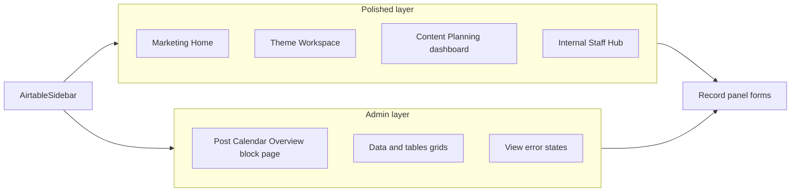
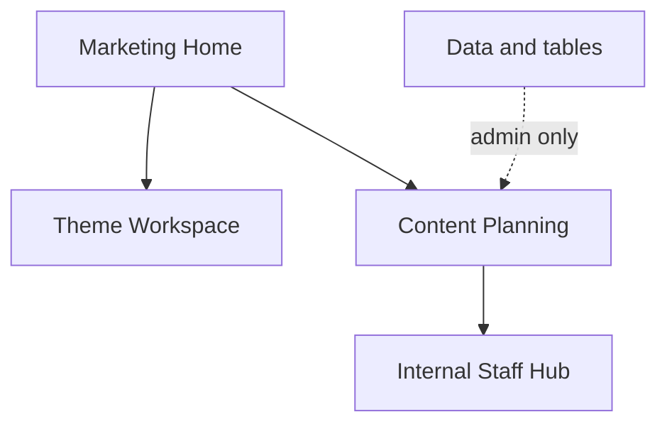

# Marketing Hub — UX/UI Audit

**Date:** 21 May 2026  
**Scope:** Marketing-facing interface pages, navigation, data views, edit/view modes  
**Evidence:** Screen recording `Recording 2026-05-21 120136.mp4` (~2m 34s) + codebase review  
**Status:** Audit only — no implementation in this document  

**Related docs:** [UI/CSS Architecture Audit](ui-css-architecture-audit.md), [Marketing Hub Product Audit](audits/MARKETING_HUB_AUDIT.md), [Edit Mode Matrix](architecture/EDIT_MODE_MATRIX.md)

---

## 1. Executive summary

Marketing Hub is **two products wearing one shell**:

| Layer | What users see | Fit for marketing team |
|-------|----------------|------------------------|
| **Marketing workspaces** | Bespoke dashboards: Marketing Home, Theme Workspace, Content Planning (code), Internal Staff Hub | Good direction — cards, hierarchy, purpose |
| **Admin / data layer** | `Data & tables` grids, block-canvas pages (e.g. Post Calendar Overview), record forms in slide-over panel | Feels like Airtable admin — heavy, spreadsheet-first |

The screen recording validates the issues raised in planning: **inconsistency**, **visually heavy tables**, **unclear page purpose** in places, and **edit flow that feels separate from view**.

### What is working

- Four core marketing pages exist as **dedicated React dashboards** (not block grids at runtime).
- **Theme Workspace** is the clearest strategic overview (four quarterly theme cards, active quarter, prompts).
- **Internal Staff Hub** has moved toward a **card-based resource library** (categories, carousel, grid/list).
- **Edit mode on bespoke pages** now keeps the same layout with `EditableDashboardRegion` chrome (code); no full swap to legacy block canvas on those routes.

### What must improve

1. **Navigation** — dark, dense sidebar; long `Data & tables` tree; naming collisions (“Marketing Home” vs Archive “Dashboard”).
2. **Calendar / planning** — recording shows **Post Calendar Overview** (block page), not the bespoke **Content Planning** dashboard; duplicate entry points confuse purpose.
3. **Record editing** — clicking dashboard items opens a **dense field form** in the record panel; breaks the “executive snapshot” feel.
4. **Tables** — Content / Social Media grids are grey, toolbar-heavy, with inconsistent status labels and weak empty/error states.
5. **Staff Hub previews** — mostly gradient placeholders; preview modal shows raw HTML and “preview not available” for many files.
6. **Campaign Workspace** — deprecated; should not appear in user mental model.

### Recommended north star

> **Marketing pages = glanceable, card-first, calendar- or library-led.**  
> **Tables = admin-only, behind a clearly labelled “Data & tables” zone.**

### Experience map (code + recording)

**Edit/view (code):** Bespoke pages render the same dashboard in view and edit via [`EditableDashboardRegion`](../baserow-app/components/interface/EditableDashboardRegion.tsx) ([`InterfacePageClient.tsx`](../baserow-app/components/interface/InterfacePageClient.tsx)). **Recording:** users edit via the **record panel** (dense field form), not page-layout edit mode.

---

## 2. Visual evidence (screen recording)

**File:** `Recording 2026-05-21 120136.mp4`  
**Duration:** ~154 seconds  
**Method:** Frame review at ~8s intervals + targeted timestamps

| Time | Page / state | Observations |
|------|----------------|---------------|
| 0–25s | Marketing Home | KPI row (61 upcoming, 11 this week, **123 overdue**, 11 campaigns); core focus + upcoming list; social snapshot + pipeline; search hint (Ctrl+K) |
| 25–35s | Marketing Home + record panel | List click opens **right record panel** — raw fields (city, venue, Social Media section); admin form, not dashboard-native |
| 30s | Theme Workspace (loading) | “Loading themes…”; **active nav item low contrast** on purple sidebar |
| 35s | Theme Workspace | Four quarterly cards; Q2 active; prompts; year + quarter controls — **strong fit for goals** |
| 40–45s | Post Calendar Overview | Block-calendar page: filter chip, date shortcuts, 6-week grid; **truncated event titles**; not bespoke Content Planning |
| 50–75s | Internal Staff Hub | Hero, categories, recent uploads, asset grid; **mostly icon/gradient placeholders**; one real thumbnail (WCC Media Pack) |
| 65s | Staff Hub preview modal | Description shows **unrendered HTML** (`
…
`); “Preview not available” for link files |
| 85–125s | Content – All Records / Social Media | Full spreadsheet: view tabs, Design/Filter/Sort/Group toolbar; pills; **To Do vs Todo** inconsistency; bulk bar when row selected |
| 120s | Content – Social Media (grid) | **Empty grid** — no helpful empty state |
| 135s | View error | Generic error; CTA **“Back to tables”** reinforces database framing |
| 145s | Theme Guides – All Records | Dense admin grid (linked records, division pills) |

**Not captured in recording:** Bespoke `ContentPlanningDashboard` (calendar-first layout in code). User navigated to **Post Calendar Overview** instead. **Campaign Workspace** not visited (archived in provisioning script).

---

## 3. Page-by-page findings

Each page uses the same structure: purpose → works → issues → simplify → visual vs tables → reuse → quick wins → bigger improvements.

---

### 3.1 Marketing Home

**Purpose:** Executive snapshot for leadership and coordinators — current quarter theme, core focus, upcoming content, social cadence, pipeline health. Not a full database.

**Implementation:** [`MarketingHomeDashboard.tsx`](../baserow-app/components/interface/MarketingHomeDashboard.tsx) via `layout_style: marketing_home`.

#### What currently works

- Card-based layout with `DashboardPanel`, `MetricCard`, pipeline stages, week strip.
- Clear sections: KPIs, core focus, upcoming list, social snapshot, content pipeline.
- Click-through to records via `useRecordModal`.
- Quarter hero panel (visible in recording ~25s) ties to active theme.

#### Confusing or cluttered

- **Duplication:** “Current quarter” hero and “Current core focus” panel repeat theme name, messaging, and prompts.
- **Overdue dominates:** 123 overdue with “Needs attention” — correct data but alarming without context or filtered drill-down.
- **Upcoming list is long** (10 items, scroll) — reads like a table list, not a snapshot.
- **Record panel** (recording): opening an item shows full schema form — feels like leaving the dashboard.
- **IA:** Sidebar lists “Dashboard” under Archive while this page is “Marketing Home”.
- **Search banner** adds chrome at top; minor distraction on a snapshot page.

#### Simplify

- One **hero** block (quarter + theme + 3 prompts max).
- KPI row: max 4 metrics; link each to filtered Content Planning view.
- Upcoming: **5 items max** + “View all in Content Planning”.
- Drop or merge duplicate core-focus panel.
- Soften overdue: show top 3 categories or “View overdue in Planning” rather than raw count only.

#### Visual / cards vs tables

- Keep cards; **no grid table** on this page.
- Upcoming rows: reuse compact `RecordCard` / list pattern, not spreadsheet.

#### Components to reuse globally

- `MetricCard`, `DashboardPanel`, `DashboardEmpty`, `TEXT_PAGE_TITLE` / `TEXT_META`, `UpcomingRow` pattern → general “scheduled item list”.

#### Quick wins

- Cap upcoming list at 5; add footer link to Content Planning.
- Remove duplicate core-focus section content already in hero.
- Align sidebar label: remove or rename Archive “Dashboard”.

#### Bigger improvements

- “Insight tiles” instead of second list (e.g. overdue by type, this week’s social gaps).
- Click KPI → deep link with filters applied.
- Record panel: summary header + 5 key fields only on Home context.

---

### 3.2 Content Planning

**Purpose:** Calendar-first planning workspace — schedule and track marketing content; filters support the calendar; sidebar supports (deadlines, campaigns, gaps), does not compete.

**Implementation:** [`ContentPlanningDashboard.tsx`](../baserow-app/components/interface/ContentPlanningDashboard.tsx) via `layout_style: content_planning`.

#### What currently works (code; not shown in recording)

- Layout: `xl:flex-row` — calendar `flex-1`, right rail `260px` (deadlines, campaigns, content gaps).
- `ContentPlanningCalendar` as primary region; compact upcoming list under calendar (`max-h-[200px]`).
- Shared `MarketingFilterStrip`, year/quarter/type filters, colour-by mode.

#### Confusing or cluttered (recording + IA)

- Recording shows **Post Calendar Overview** — block-built page with heavy filter toolbar and 6-week grid — user may think this *is* Content Planning.
- Two calendars in product = **split purpose**.
- Block calendar: truncated labels (“Social Me…”), many controls on one row.

#### Simplify

- Single canonical route: **Content Planning** for all marketing scheduling.
- Redirect or archive Post Calendar Overview with banner.
- Collapse filters to one row + “More filters” on smaller screens.
- Right rail: collapsible on tablet; defaults hidden on mobile with drawer.

#### Visual / cards vs tables

- **Calendar dominates** (70%+ width on desktop).
- Campaigns/deadlines: compact list cards, not grids.
- No full Content table on this page.

#### Components to reuse globally

- `ContentPlanningCalendar`, `MarketingFilterStrip`, `MarketingPanelSecondary`, `MarketingInsightCard` (gaps).

#### Quick wins

- Nav label tooltip: “Plan content (calendar)”.
- Redirect Post Calendar Overview → Content Planning.
- Increase calendar min-height in CSS.

#### Bigger improvements

- Merge Post Calendar block into dashboard or drop block page.
- Drag-and-drop reschedule on bespoke calendar (if data model supports).
- Unified “add content” FAB on calendar.

---

### 3.3 Theme Workspace

**Purpose:** Simple strategic overview — four themes per year, current quarter emphasis, prompts, minimal operational noise. No heavy tables.

**Implementation:** [`ThemeOverviewDashboard.tsx`](../baserow-app/components/interface/ThemeOverviewDashboard.tsx) via `layout_style: theme_overview`.

#### What currently works

- Recording: four quarterly `AccentCard`s, active Q2 hero, prompt lists, year selector — **best match to product vision**.
- Empty states on Q3/Q4 (“No prompts yet”) with add prompt action.
- Clear page subtitle in header.

#### Confusing or cluttered

- Brief **loading** state with poor active-nav contrast on sidebar.
- Prompts are text-only — no linked content preview counts.
- Page title “Theme overview” in code vs nav “Theme Workspace” (minor).

#### Simplify

- Skeleton cards while loading.
- Show “N content items” per theme (badge), not a table.
- Limit prompts visible to 3 + “N more” (already partially done).

#### Visual / cards vs tables

- **Cards only** — keep 4-column theme grid; no grid view.

#### Components to reuse globally

- `AccentCard`, `ThemeCard` pattern, `DashboardEmpty`, quarter badges.

#### Quick wins

- Fix sidebar active-state contrast on purple background.
- Align display name: “Theme Workspace” everywhere.

#### Bigger improvements

- Optional “Open in Content Planning” per theme with filter query param.
- Visual quarter timeline (4 nodes) above cards.

---

### 3.4 Internal Staff Hub

**Purpose:** Visual resource / media library for brand assets, decks, templates, Drive folders — not a table of links.

**Implementation:** [`InternalStaffHubDashboard.tsx`](../baserow-app/components/interface/InternalStaffHubDashboard.tsx), [`AssetCard`](../baserow-app/components/interface/internal-staff-hub/AssetCard.tsx), [`drive-link.ts`](../baserow-app/lib/marketing/drive-link.ts).

#### What currently works

- Recording: hero, category strip, recent uploads carousel, grid of assets, grid/list toggle, quick access column.
- Google Drive / SharePoint badges on cards.
- One card with **real image preview** (WCC Media Pack) proves the pattern.

#### Confusing or cluttered

- **~90% placeholder gradients** + generic icons — still feels template/demo, not library.
- **Duplicate search** (hero + “All assets” filter bar).
- Preview modal: **HTML tags visible** in description; “Preview not available” for many types (recording).
- “All assets” wrapped in `DashboardPanel` — nested admin chrome.
- Hub buried under Public in sidebar — easy to miss.

#### Simplify

- One search; categories as primary browse path.
- Featured row (3–4 items with real thumbnails) always visible.
- Reduce default grid density (3–4 columns, not 5–6 on XL).

#### Visual / cards vs tables

- **Cards only** — never default to list/table for marketers.
- List view for power users only.

#### Components to reuse globally

- `AssetCard`, `CategoryCard`, `UploadCarousel`, `QuickAccessPanel`, `AssetPreviewModal` — pattern for any media library block.

#### Quick wins

- Sanitize rich text in preview modal (DOMPurify / render HTML properly).
- Improve Drive/SharePoint embed fallback copy.
- Pin Staff Hub higher in nav (top-level, not only under Public).

#### Bigger improvements

- Thumbnail pipeline: Drive API / og:image / cached previews.
- Folder browse for General Gallery (embed already partially implemented).
- Tag chips on cards; filter by tag without dropdown-only UX.

---

### 3.5 Campaign Workspace

**Purpose (historical):** Campaign-level KPIs, list + calendar blocks.

**Status:** **Deprecated / archived** in [`apply-marketing-hub-workspace.cjs`](../baserow-app/scripts/apply-marketing-hub-workspace.cjs). Not shown in recording.

#### Recommendation

- Do not invest in UI.
- Remove from nav if any row remains; redirect to Content Planning or Marketing Home.
- Document in admin settings only.

---

### 3.6 Post Calendar Overview (block interface page)

**Purpose (as deployed):** Social/content calendar via `GridBlock` + FullCalendar.

**Not the bespoke Content Planning dashboard.**

#### What currently works

- True multi-week calendar; filter for Social Media; colour-coded events.

#### Confusing or cluttered

- Competes with Content Planning; truncated titles; busy toolbar; **interface-builder aesthetic** vs marketing dashboards.

#### Simplify

- Redirect to Content Planning with equivalent filters, or merge data source into bespoke calendar.

#### Visual / cards vs tables

- Calendar yes; **no grid table** on marketer-facing route.

---

### 3.7 Data & table pages (`/tables/...`)

**Purpose:** Power users and admins — bulk edit, schema, imports, all fields. Appropriate for **database editing**.

**Implementation:** [`AirtableGridView`](../baserow-app/components/grid/AirtableGridView.tsx), [`AirtableSidebar`](../baserow-app/components/layout/AirtableSidebar.tsx) data section.

#### What currently works

- Multiple view types per table (Grid, Kanban, Timeline, Gallery).
- Bulk action bar (2+ rows).
- Coloured type/status pills.

#### Confusing or cluttered (recording)

- Grey cell borders, dense toolbars (Design, Add Field, Filter, Sort, Group, Row Height, Hide Fields).
- Empty columns (Date To, Date Due) with “—” add noise.
- **To Do** vs **Todo** vs **Opportunity** inconsistent casing/colours.
- Empty Social Media view — blank grid, no CTA.
- **View error** + “Back to tables” — hostile to marketers.
- Sidebar: every table uses same database icon.

#### Simplify

- Collapse `Data & tables` by default in sidebar.
- Label zone: “Admin data” or “Advanced tables”.
- Hide empty columns by default in views.
- Normalize status display names in view layer.

#### Visual / cards vs tables

- **Tables appropriate here only.**
- Prefer Gallery/Kanban for Content sub-views when marketers must use tables route.

#### Components to reuse globally

- `EmptyTableState`, `BulkActionBar`, semantic tokens from CSS audit (reduce `gray-*` in grids).

#### Quick wins

- Empty state on Social Media grid with link to Content Planning.
- View error: “Back to Marketing Home” + friendlier copy.
- Status label normalization.

#### Bigger improvements

- Separate shell: lighter chrome for `/tables` vs `/pages`.
- Role-based nav: hide Data & tables from `member` role if policy allows.

---

### 3.8 Edit mode & record editing

**Audit scope:** Edit mode preview — how view vs edit feels on marketing pages and when opening records.

#### Page layout edit (bespoke pages)

- **Code:** `EditableDashboardRegion` — hover/selection rings; same dashboard in view and edit (`isBespokeMarketingPage` skips canvas `pb-48`). **Aligned with goal.**
- **Recording:** User did **not** enter page layout edit; no dashed block canvas observed on marketing routes.

#### Record edit (what users actually do)

- **Recording (25–35s, 40s):** Clicking Home list items or calendar events opens **RecordPanel** — full field schema (Content Type, Status, Social Media section, venue fields). Feels like Airtable admin, not dashboard-native.
- **Target:** Summary header + key fields; “Open full record” for power users; hide empty fields.

#### Block-canvas edit (generic interface pages)

- Generic pages use `InterfaceBuilder` + dashed `Canvas` blocks — different paradigm from bespoke dashboards.
- Post Calendar Overview is a **view-mode block page** in the recording; edit mode would show grid builder (not tested in clip).

#### Quick wins

- Record panel: section headers matching `DashboardPanel`; hide empty fields.
- Marketing context: show title + status + date + link “Open full record”.

#### Bigger improvements

- Inline preview edit on cards (status, date only).
- Page edit: section order/visibility in right panel, not block grid, for bespoke pages.

---

### 3.9 Sidebar & navigation

**Implementation:** [`AirtableSidebar.tsx`](../baserow-app/components/layout/AirtableSidebar.tsx), [`WorkspaceShellWrapper.tsx`](../baserow-app/components/layout/WorkspaceShellWrapper.tsx) (`MARKETING_CORE_PAGE_ORDER`).

#### What currently works

- Core four pages ordered: Dashboard (Home), Theme Workspace, Content Planning, Internal Staff Hub.
- Collapsible sections; compact rail option; workspace settings entry.

#### Confusing or cluttered (recording)

- **Visually heavy** purple sidebar vs white content.
- Long expanded lists (Public, Social Media, Other, Archive).
- **Data & tables** exposes entire schema — dominates for admins.
- Duplicate “Marketing Home” under Public.
- Active state **illegible** during Theme Workspace load.

#### Quick wins

- Collapse Data & tables by default.
- Fix active link contrast (WCAG).
- Deduplicate Marketing Home in Public group.
- Rename Archive “Dashboard” → “Legacy dashboard” or remove.

#### Bigger improvements

- Two-tier nav: **Work** (4 pages) vs **Data** (tables).
- Lighter sidebar surface using branding tokens without full purple fill.

---

### 3.10 Blocks, cards, calendars, galleries (cross-cutting)

| View | Where | Recording / code | Recommendation |
|------|--------|------------------|----------------|
| Bespoke dashboards | `/pages/{id}` marketing styles | Polished | Extend pattern |
| Block grid | Generic interface pages | Heavy calendar toolbar | Reduce or redirect |
| `grid/GridView` | Interface blocks | Grey table chrome | Semantic tokens; avoid on marketing pages |
| `AirtableGridView` | `/tables` | Recording t85–125 | Admin only |
| Gallery / Kanban | Table sub-views | Not in recording | Use for content subsets |
| `AssetCard` | Staff Hub | Placeholder-heavy | Real thumbnails |

**Empty states:** Mix of `DashboardEmpty`, `EmptyState`, inline grey text in `GridBlock`, and blank grids — **standardize on `EmptyState` + illustration** with one CTA.

---

## 4. Recommended information architecture

### Primary navigation (marketing workflow)

| Order | Page | User question answered |
|-------|------|------------------------|
| 1 | Marketing Home | “How are we doing this quarter?” |
| 2 | Theme Workspace | “What are we focusing on?” |
| 3 | Content Planning | “What’s scheduled and what’s at risk?” |
| 4 | Internal Staff Hub | “Where are brand assets and decks?” |

### Secondary

- Post Calendar Overview → **redirect** to Content Planning (or hide).
- Contacts, other interface pages — group under “More” collapsed.

### Tertiary (admin)

- **Data & tables** — collapsed by default; subtitle in UI: “Advanced data & bulk editing”.
- Workspace settings — footer only.

### Landing

- Default: Marketing Home ([`resolveLandingPage`](../baserow-app/lib/interfaces.ts)).
- Avoid landing on a table view for standard members.

---

## 5. Component reuse recommendations

| Primitive | Location | Use on |
|-----------|----------|--------|
| `PanelShell` / `DashboardPanel` | `components/interface/primitives/` | All dashboards, record panel sections |
| `MetricCard` | `primitives/MetricCard.tsx` | Home KPIs only |
| `AccentCard` | `primitives/AccentCard.tsx` | Theme cards, Staff Hub hero |
| `RecordCard` | `components/views/cards/RecordCard.tsx` | Lists, Kanban, Gallery, upcoming rows |
| `MarketingFilterStrip` | `components/layout/ui-system.tsx` | Content Planning |
| `MarketingPanelSecondary` | via `PanelShell` | Side rails, compact lists |
| `EditableDashboardRegion` | `EditableDashboardRegion.tsx` | Section edit chrome on bespoke pages |
| `EmptyState` / `DashboardEmpty` | `components/empty-states/` | All empty cases |
| `AssetCard` + preview modal | `internal-staff-hub/` | Staff Hub; future media blocks |

### Avoid / consolidate

- Duplicate KPI presentations (`KPIBlock` vs `MetricCard` on Home).
- `MarketingPanel*` vs `DashboardPanel` duplicate styling paths.
- Unwired `ListBlock.tsx` — use `GridBlock` + `ListView` only.
- Two grid implementations (`views/GridView` vs `grid/GridView`) — document internally; do not use wrong one on interfaces.

---

## 6. Visual design recommendations

Build on completed CSS audit phases ([`ui-css-architecture-audit.md`](ui-css-architecture-audit.md)):

1. **Sidebar** — Reduce contrast block (softer `sidebarColor` or neutral rail); fix active item (recording: Theme Workspace load).
2. **Page headers** — Always `TEXT_PAGE_TITLE` + one-line `TEXT_META` purpose statement.
3. **Density** — Marketing: `DASHBOARD_PAGE_GAP`, generous whitespace; Tables: dense but isolated in admin zone.
4. **Status system** — One palette + canonical labels (Todo, Scheduled, Published, etc.).
5. **Thumbnails** — Real previews for Drive/SharePoint; shared fallback illustration (not random gradient only).
6. **Record panel** — Card-grouped fields; match `rounded-card`, `border-border`; no raw HTML in previews.
7. **Tables** — Migrate `gray-*` chrome to semantic tokens in `grid/GridView` and `AirtableGridView`.

### Edit vs view (target)

- **View:** What recording shows for dashboards — keep.
- **Edit:** Light section rings (`EditableDashboardRegion`) + right panel for section settings — **not** dashed block canvas on marketing routes.
- **Record edit:** Contextual compact panel, not full schema by default.

---

## 7. Quick wins (prioritised)

| # | Item | Effort | Impact |
|---|------|--------|--------|
| 1 | Fix preview modal HTML rendering + Drive embed | S | Staff Hub trust |
| 2 | Sidebar: collapse Data & tables by default; fix active contrast | S | Navigation clarity |
| 3 | Rename/remove Archive “Dashboard” vs Marketing Home | S | IA |
| 4 | Redirect Post Calendar Overview → Content Planning | S | Planning clarity |
| 5 | Marketing Home: merge duplicate focus blocks; cap upcoming at 5 | M | Executive snapshot |
| 6 | Normalize status labels (To Do / Todo) in display layer | S | Table polish |
| 7 | Empty Social Media grid → `EmptyTableState` + link to Planning | S | Dead-end removal |
| 8 | View error: friendly copy + link to Home | S | Error UX |
| 9 | Staff Hub: 3–4 column grid max; single search | S | Library feel |
| 10 | Record panel: hide empty fields; marketing summary header | M | Edit/view connection |

---

## 8. Larger refactor items

1. **Dual shell** — Marketing workspace chrome vs admin table chrome (different sidebars or nav modes).
2. **Content Planning consolidation** — One calendar product surface; retire duplicate block page.
3. **Record experience 2.0** — `RecordCard`-based panel; optional full-page record for power users.
4. **Thumbnail / preview pipeline** — Drive/SharePoint with caching for Staff Hub (and Gallery blocks).
5. **Section-based page settings** — Wire `EditableDashboardRegion` to config (order, visibility) without `view_blocks` grid on marketing pages.
6. **Interface block styling pass** — `marketingDashboardStyle` on all marketer-facing blocks; gallery/list default over grid.
7. **Role-based navigation** — Members see Work nav only; admins see Data & tables.
8. **Campaign / legacy cleanup** — DB + nav hygiene for archived pages.

---

## 9. Prioritised implementation roadmap

### P0 — Weeks 1–2 (polish & trust)

- Quick wins #1–4, #6–9 above.
- QA path from recording: Home → Theme → Staff Hub → table (admin).

**Outcome:** Navigation and Staff Hub feel intentional; planning entry point clear.

### P1 — Weeks 2–4 (marketing journey)

- Marketing Home layout refinement (#5).
- Content Planning as canonical calendar; redirect legacy calendar page.
- Sidebar IA (core four pinned, data collapsed).

**Outcome:** Marketers can answer “what’s on this quarter / what’s due” without hitting tables.

### P2 — Weeks 4–6 (edit connection & tables)

- Record panel redesign (#10).
- Table zone labelling; empty/error states.
- Grid token alignment (interface + core).

**Outcome:** Editing feels part of the same product, not a separate admin app.

### P3 — Weeks 6–10 (depth)

- Thumbnail pipeline.
- Optional dual shell for `/tables`.
- Section config for bespoke page edit.

**Outcome:** Sustainable consistency as new pages/blocks are added.

### Manual QA checklist (from recording scenarios)

Use after each implementation phase:

| Step | Route / action | Pass criteria |
|------|----------------|---------------|
| 1 | Marketing Home | Hero + KPIs readable; upcoming ≤5 or scroll labeled; overdue actionable |
| 2 | Theme Workspace | Four theme cards; active quarter obvious; nav active state readable while loading |
| 3 | Content Planning | Calendar dominates width; filters do not crowd calendar; right rail secondary |
| 4 | Internal Staff Hub | Card grid; previews/embeds work; no raw HTML in modal description |
| 5 | Post Calendar Overview | Redirect or banner to Content Planning (post-P0) |
| 6 | Content → All Records | Admin-only feel acceptable; status labels consistent |
| 7 | Record open from Home | Panel feels summary-first, not full schema dump |
| 8 | View error recovery | Copy friendly; link to Marketing Home, not “tables” only |
| 9 | Edit mode (admin) | Bespoke page shows section rings, not block canvas swap |
| 10 | Sidebar | Data & tables collapsed by default; no duplicate Home labels |

---

## 10. Open questions

1. Should **Post Calendar Overview** be deleted, redirected, or rebuilt inside Content Planning?
2. Should **members** lose `Data & tables` in nav entirely, or view-only subsets?
3. Is **123 overdue** on Home a data hygiene issue vs UX (cap, filter, or separate “cleanup” workflow)?
4. Should record panel remain slide-over or become inline canvas only ([`P2_INLINE_CANVAS_IMPLEMENTATION.md`](audits/P2_INLINE_CANVAS_IMPLEMENTATION.md)) for marketing pages?

---

## Appendix: Code map (marketing pages)

| Page | Detector | Dashboard component |
|------|----------|---------------------|
| Marketing Home | `lib/marketing/marketing-home.ts` | `MarketingHomeDashboard` |
| Theme Workspace | `lib/marketing/theme-overview.ts` | `ThemeOverviewDashboard` |
| Content Planning | `lib/marketing/content-planning.ts` | `ContentPlanningDashboard` |
| Internal Staff Hub | `lib/marketing/internal-staff-hub.ts` | `InternalStaffHubDashboard` |

**Route:** `/pages/[pageId]` → [`InterfacePageClient.tsx`](../baserow-app/components/interface/InterfacePageClient.tsx) → bespoke branch before `InterfaceBuilder`.

**Provisioning:** [`scripts/apply-marketing-hub-workspace.cjs`](../baserow-app/scripts/apply-marketing-hub-workspace.cjs)

---

*End of audit. Implementation should follow roadmap phases after stakeholder sign-off.*
