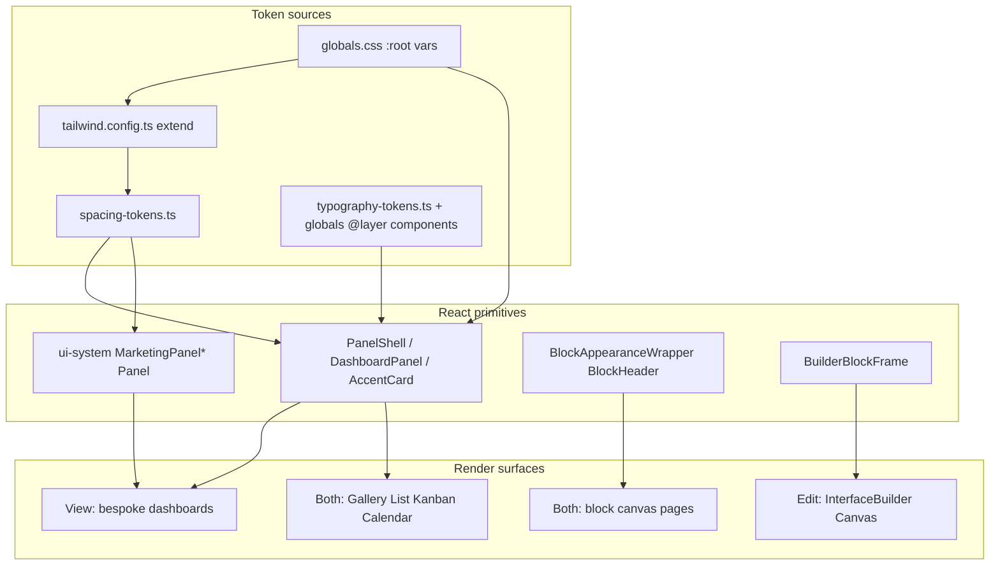

# UI/CSS Architecture Audit

**Date:** May 2026  
**Scope:** View vs edit styling, marketing dashboards, block canvas, data views, global CSS/tokens.  
**Status:** Audit complete; Phases 1–5 implementation tracked below.

---

## 1. Executive summary

The app runs **three overlapping visual systems**, not one:

| Stack | Radius / shadow | Primary consumers |
|-------|-----------------|-------------------|
| **Marketing surface system** | `rounded-card` / `rounded-card-lg`, `shadow-card`, CSS classes `.surface-card`, `.panel-shell` | Dedicated dashboards (`DashboardPanel`, `AccentCard`, `MetricCard`), marketing-styled blocks, `RecordCard` |
| **Legacy shadcn-style shell** | `rounded-xl`, `shadow-sm` | `ui-system.tsx` `Panel`, `AppCard`; default `ListView` / `GalleryView` / `KanbanView` chrome |
| **Builder chrome** | `rounded-lg`, dashed borders, selection rings | `Canvas.tsx` `block-container` when `isEditing` |

The **largest architectural mismatch** is structural, not only cosmetic:

- **View mode** on marketing pages renders **entirely bespoke React trees** (`MarketingHomeDashboard`, `ContentPlanningDashboard`, `ThemeOverviewDashboard`) gated by `!isEditMode` in `InterfacePageClient.tsx`.
- **Edit mode** on the same pages renders **`InterfaceBuilder` + `Canvas` + react-grid blocks** — a different UI paradigm than the polished view.

Edit mode cannot match view mode until either (a) dashboards are composed from the same block primitives in both modes, or (b) edit mode previews the bespoke layout with builder chrome overlaid (**recommended direction:** shared primitives + chrome only).

Grid geometry is already WYSIWYG between modes (`GRID_CONFIG` identical; only `isDraggable` / `isResizable` differ). **Surface styling was not** — addressed in Phases 1–4 below.

### Implementation status (Phases 1–5)

| Phase | Goal | Status |
|-------|------|--------|
| 1 | Canonical tokens + CSS aliases | Done — `spacing-tokens.ts`, `globals.css` `.surface-panel` |
| 2 | `BuilderBlockFrame` + semantic appearance + shared table shell | Done — `BuilderBlockFrame.tsx`, `Canvas.tsx`, `appearance-utils.ts`, `ListView` default shell |
| 3 | `PanelShell` unifies panel primitives | Done — `PanelShell.tsx`; `DashboardPanel` + `MarketingPanel*` delegate |
| 4 | Scoped scrollbars, accent links, data view tokens | Done — `globals.css`, `GalleryView`, `KanbanView` |
| 5 | Visual QA matrix | Documented in §10 |

---

## 2. Current styling layers



| Layer | Source | Role |
|-------|--------|------|
| 1 | `baserow-app/app/globals.css` | CSS variables, surface classes, typography utilities, grid/calendar/editor globals |
| 2 | `baserow-app/tailwind.config.ts` | Maps vars to `rounded-card`, `shadow-card`, breakpoints |
| 3 | `baserow-app/lib/interface/spacing-tokens.ts` | Composed Tailwind strings, marketing/builder tokens |
| 4 | `baserow-app/lib/interface/typography-tokens.ts` | `TEXT_*` class names → globals `@layer components` |
| 5 | `baserow-app/components/interface/primitives/` | `PanelShell`, `DashboardPanel`, `AccentCard`, `MetricCard`, `BuilderBlockFrame` |
| 6 | `baserow-app/components/layout/ui-system.tsx` | Layout shell, `MarketingPanel*` (delegates to `PanelShell`) |
| 7 | Mode gates | `useUIMode().isEdit()`, `effectiveIsEditing`, `marketingDashboardStyle`, dedicated dashboard flags |

---

## 3. Duplication / conflict map (pre-refactor)

| Concept | Definitions | Conflict |
|---------|-------------|----------|
| **Primary panel** | `DashboardPanel` (`panel-shell` + `rounded-card-lg`) | `MarketingPanelPrimary` (+ extra ring) |
| **Secondary panel** | Lighter panels | `MarketingPanelSecondary` used `rounded-lg` (8px) not `rounded-inner` (12px) |
| **Card surface** | `.surface-card` / `AccentCard` | `AppCard`: `rounded-xl shadow-sm` |
| **Table shell** | `ListView` + `Panel` | Marketing branch stacked redundant utilities |
| **Block title** | `BlockHeader`, `BlockAppearanceWrapper`, `DashboardPanel`, `MarketingPanelSecondary` | Four header patterns |
| **Metric tile** | `MetricCard`, `KPIBlock`, inline home tiles | Three KPI presentations |
| **CSS duplicates** | `.surface-card`, `.marketing-card`, `.panel-shell` | Same rules repeated |

**Post-refactor:** `PanelShell` is the single React primitive for panels; `.surface-panel` aliases legacy CSS classes.

---

## 4. View mode vs edit mode divergence table

| Area | View mode | Edit mode | Shared? |
|------|-----------|-----------|---------|
| Marketing home / content planning / theme overview | Bespoke dashboard components | **Not rendered** — block canvas | **No** (structural fork) |
| `MarketingDashboardLayout` | View wrappers | `MarketingDashboardCanvasShell` on canvas | Partial |
| `CanvasContainer` | Default | Extra `pb-48` | Shell only |
| `RightSettingsPanel` | Absent | 360px column | Edit-only |
| `BuilderBlockFrame` | Transparent pass-through | Dashed border + selection rings | Chrome only |
| Block inner content | Same | Same | **Yes** |
| `RecordCard` / `AccentCard` | Same | Same | Yes |
| Gallery/List default | Semantic tokens (Phase 4) | Same | Yes |
| Kanban | Semantic tokens (Phase 4) | Same | Yes; no marketing branch |
| Dedicated dashboard typography | `TEXT_PAGE_TITLE` | N/A in edit | View-only |

**Dual edit flags:** Shell uses `useUIMode().isEdit()`; canvas uses `effectiveIsEditing` / `Canvas` `isEditing`.

### Key code gates

Dedicated dashboards hidden in edit mode:

```1519:1521:baserow-app/components/interface/InterfacePageClient.tsx
            showThemeOverview={themeOverview && !isEditMode}
            showContentPlanning={contentPlanning && !isEditMode}
            showMarketingHome={marketingHome && !isEditMode}
```

Edit-mode canvas bottom padding:

```1500:1503:baserow-app/components/interface/InterfacePageClient.tsx
        <CanvasContainer
          scrollOwner={suppressMainScroll ? "parent" : "self"}
          fullBleed
          className={`relative ${suppressMainScroll ? "flex-1 min-h-0" : "min-h-full"} ${isEditMode ? "pb-48" : ""}`}
```

Builder chrome (now via `BuilderBlockFrame` + `BUILDER_CHROME_*` tokens):

```2371:2386:baserow-app/components/interface/Canvas.tsx
                className={`block-container relative ${
                  isEditing
                    ? `group bg-white border-2 border-dashed ...`
                    : "bg-transparent border-0 shadow-none"
                }`}
```

---

## 5. Answers to audit questions (1–10)

### 1. View mode only

- `MarketingHomeDashboard.tsx`, `ContentPlanningDashboard.tsx`, `ThemeOverviewDashboard.tsx`
- `MarketingDashboardLayout.tsx` (search banner, shell)
- `DashboardPanel`, `MetricCard`, `DashboardEmpty`, theme/home `AccentCard` grids
- `MarketingPanel*` on content planning (via `PanelShell`)
- `.marketing-dashboard-shell`, `[data-marketing-dashboard]` globals
- `.calendar-embed--hero`

### 2. Edit mode only

- `RightSettingsPanel.tsx`, `WorkspaceShell.tsx` 360px column
- `BuilderBlockFrame` when `isEditing`
- Drag handle, block actions, snap overlays, `FloatingBlockPicker`
- `InterfacePageClient` `pb-48`, `InterfaceBuilder` footer spacers
- `EditModeBanner`
- Grid transition injection in `Canvas`
- `react-grid-item:has([data-block-editing="true"])` in globals

### 3. Shared (both modes)

- `Canvas`, `BlockRenderer`, `BlockAppearanceWrapper`
- `BlockHeader` on KPI, Grid, List, Chart, Action, LinkPreview
- `RecordCard` / `AccentCard`
- Data view class lists (edit flag does not change chrome)
- `spacing-tokens`, `typography-tokens` where imported
- `PanelShell` / `Panel` for settings and tables

### 4. Duplicate systems (resolved / remaining)

| Resolved | Remaining |
|----------|-----------|
| Panels → `PanelShell` | Structural view/edit dashboard fork |
| Builder chrome → tokens + `BuilderBlockFrame` | `AppCard` still legacy (deprecate) |
| CSS `.surface-panel` alias | shadcn `Card` in settings only |
| `appearance-utils` semantic | Content planning raw page title |

### 5. Hard-coded styles vs tokens

See §3; Phase 4 addressed scrollbars, ProseMirror links, gallery/kanban grays. `AppCard` / content planning title remain follow-ups.

### 6. Where edit diverges visually from view

1. Whole-page swap on marketing routes (unchanged — needs structural decision A/B)
2. Block outer chrome — now tokenized via `BuilderBlockFrame`
3. Layout width — 360px settings panel
4. Canvas bottom padding
5. Theme overview layout shell differences

### 7. Global CSS risks

| Rule | Risk | Mitigation |
|------|------|------------|
| `* { @apply border-border }` | Universal | Keep; document |
| `*` scrollbars | Was app-wide | **Scoped** to `.app-scrollable`, `.grid-scroll-container`, `.sidebar-scroll` |
| `.dark [data-sidebar] !important` | Brittle | Keep until branding refactor |
| `.react-grid-layout` handles | All grids | Required for canvas |
| `.ProseMirror a` | Hard-coded blue | **Uses `hsl(var(--accent-link))`** |
| `[data-marketing-dashboard]` | Fragile selectors | Prefer component props long-term |

### 8. Should become shared primitives

- `PanelShell` — **implemented**
- `AccentCard` — existing
- `BlockHeader` — canonical in-block titles
- `BuilderBlockFrame` — **implemented**
- `MetricCard` for KPI + dashboards — partial (KPI still separate shell)
- `DashboardEmpty` — standardize block empties
- List/table shell — **ListView default uses `surface-card`**

### 9. Edit-mode-only chrome

- `BuilderBlockFrame` dashed outline, rings, drag handle, actions
- `RightSettingsPanel`, `EditModeBanner`, `FloatingBlockPicker`
- `pb-48` / footer spacers
- Grid transition injection

### 10. May remain dashboard-view-specific

- Page-level bespoke layout composition (if built from `PanelShell` / `AccentCard`)
- Marketing command palette / search banner
- Theme overview grid density
- `calendar-embed--hero`
- KPI accent presets on `MetricCard`

---

## 6. Specific checks (requested)

| Check | Finding (pre-refactor) | After Phases 1–4 |
|-------|------------------------|------------------|
| `rounded-card-lg` vs `rounded-xl` | Three radius stacks | `PanelShell` uses token radii; `Panel`/`AppCard` legacy |
| `shadow-card` vs `shadow-sm` | Mixed | Primary surfaces use `shadow-card` |
| `panel-shell` vs `marketing-card` | Duplicates | `.surface-panel` + aliases |
| Block vs dashboard headers | Four patterns | `BlockHeader` + `PanelShell` header |
| Card padding | 10–16px spread | `densityCardPadding` on `PanelShell` |
| Title typography | Inconsistent | Content planning still uses raw `text-lg` |
| Accent styles | Gray in appearance | Semantic `muted` in `appearance-utils` |
| Empty states | Multiple | `DashboardEmpty` + ad-hoc |
| Scroll/overflow | Mixed owners | Documented; scoped scrollbars |
| Edit outlines | Gray/blue literals | `BUILDER_CHROME_*` tokens |
| Bespoke wrappers in edit | Not used | Unchanged (structural) |

---

## 7. Recommended unified architecture

```
ViewModePage = Compose(shared primitives, layout data)
EditModePage = Compose(shared primitives, layout data)
              + BuilderBlockFrame(blockId)  // outline, handle, actions only
```

**Canonical token contract** — see `baserow-app/lib/interface/spacing-tokens.ts` (`SURFACE_TOKEN_CONTRACT` comment block).

**Component hierarchy:**

1. `PanelShell` — unified section (`primary` | `secondary` | `elevated`)
2. `AccentCard` — interactive cards
3. `BlockHeader` — in-block titles
4. `BuilderBlockFrame` — edit chrome wrapper
5. Deprecate `AppCard` → alias `surface-card` (follow-up)

**Structural decision (marketing pages):**

- **A)** View dashboards compiled from same blocks as edit (long-term)
- **B)** Edit previews bespoke layout with chrome (interim)

Recommendation: **A**; use **B** only if block migration is large.

---

## 8. Phased refactor plan

### Phase 1 — Define canonical primitives/tokens ✅

- Token contract in `spacing-tokens.ts`
- `.surface-panel` in `globals.css` with aliases for `.panel-shell`, `.marketing-card`
- `MARKETING_PANEL_SECONDARY` → `rounded-inner`
- `BUILDER_CHROME_*` strings
- `APP_SECTION_GAP` documented vs `--section-gap` (CSS var for marketing shell only)

### Phase 2 — Edit mode primitives + builder chrome ✅

- `BuilderBlockFrame` extracted; `Canvas` uses it
- `appearance-utils` semantic tokens
- `ListView` default shell uses `surface-card` + `rounded-card-lg`

### Phase 3 — Dedupe panels/headers ✅

- `PanelShell` with variants; `DashboardPanel` + `MarketingPanel*` delegate

### Phase 4 — Clean global CSS ✅

- Scrollbars scoped to `.app-scrollable`, `.grid-scroll-container`, `.sidebar-scroll`
- ProseMirror / rich-text links use `--accent-link`
- Gallery/Kanban default semantic backgrounds

### Phase 5 — Visual QA ✅

See §10 checklist.

---

## 9. File path index

| Path | Role |
|------|------|
| `baserow-app/app/globals.css` | Variables, surfaces, typography, grid, calendar, scrollbars |
| `baserow-app/tailwind.config.ts` | Theme extension |
| `baserow-app/lib/interface/spacing-tokens.ts` | Layout + surface + builder tokens |
| `baserow-app/lib/interface/typography-tokens.ts` | `TEXT_*` exports |
| `baserow-app/lib/interface/appearance-utils.ts` | Block appearance classes |
| `baserow-app/components/layout/ui-system.tsx` | App shell, canvas container, marketing panels |
| `baserow-app/components/interface/primitives/PanelShell.tsx` | Unified panel |
| `baserow-app/components/interface/primitives/DashboardPanel.tsx` | Dashboard wrapper → `PanelShell` |
| `baserow-app/components/interface/primitives/AccentCard.tsx` | Card surface |
| `baserow-app/components/interface/primitives/MetricCard.tsx` | KPI tile |
| `baserow-app/components/interface/primitives/DashboardEmpty.tsx` | Empty states |
| `baserow-app/components/interface/primitives/BuilderBlockFrame.tsx` | Edit chrome frame |
| `baserow-app/components/interface/Canvas.tsx` | Grid + builder chrome |
| `baserow-app/components/interface/BlockAppearanceWrapper.tsx` | Block title/accent wrapper |
| `baserow-app/components/interface/blocks/shared/BlockHeader.tsx` | In-block header |
| `baserow-app/components/interface/MarketingDashboardLayout.tsx` | Marketing shell |
| `baserow-app/components/interface/MarketingHomeDashboard.tsx` | Home view dashboard |
| `baserow-app/components/interface/ContentPlanningDashboard.tsx` | Planning view |
| `baserow-app/components/interface/ContentPlanningCalendar.tsx` | Calendar panel |
| `baserow-app/components/interface/ThemeOverviewDashboard.tsx` | Theme view |
| `baserow-app/components/interface/InterfacePageClient.tsx` | Page shell, mode gates |
| `baserow-app/components/interface/InterfaceBuilder.tsx` | Builder layout |
| `baserow-app/components/interface/RightSettingsPanel.tsx` | Edit settings column |
| `baserow-app/components/layout/WorkspaceShell.tsx` | Shell + right panel width |
| `baserow-app/components/layout/AirtableSidebar.tsx` | Navigation sidebar |
| `baserow-app/components/views/cards/RecordCard.tsx` | Gallery/kanban card |
| `baserow-app/components/views/GalleryView.tsx` | Gallery |
| `baserow-app/components/views/ListView.tsx` | List/table |
| `baserow-app/components/views/KanbanView.tsx` | Kanban |
| `baserow-app/components/views/CalendarView.tsx` | Calendar |

---

## 10. Visual QA matrix (Phase 5)

Run after any styling change. Compare **view** vs **edit** for the same `pageId` where applicable.

| Page / surface | View checks | Edit checks | Pass |
|----------------|-------------|-------------|------|
| Marketing home | `DashboardPanel`, `MetricCard`, shell spacing | Block canvas, no bespoke dashboard | ☐ |
| Content planning | `PanelShell` primary/secondary, calendar embed | Grid blocks, picker visible | ☐ |
| Theme overview | `AccentCard` grid, badges | Standard canvas | ☐ |
| Generic interface page | Transparent blocks, data views | `BuilderBlockFrame` dashed border, 360px panel | ☐ |
| Record layout / full-page | No double scroll | Field selection, settings | ☐ |
| Gallery | `RecordCard`, semantic `bg-background` | Same + builder chrome | ☐ |
| List (default) | `surface-card` table shell | Same | ☐ |
| List (marketing) | `marketing-card` branch | Same when flag set | ☐ |
| Kanban | Column `rounded-card-lg`, muted chrome | Same | ☐ |
| Calendar | `Panel` + embed | Same | ☐ |
| Dark mode | Surfaces, links, sidebar override | Builder rings visible | ☐ |
| Sidebar navigation | Links clickable with record overlay | `md:left-64` on overlays | ☐ |
| Right panel width | N/A | 360px flex, not translate hide | ☐ |

**Regression triggers:** changes to `globals.css` surfaces, `Canvas.tsx` chrome, `PanelShell`, `spacing-tokens.ts`, `InterfacePageClient` mode gates.

---

## 11. Follow-ups (out of scope)

- Structural marketing dashboard parity (decision A vs B)
- Deprecate `AppCard` / migrate `ui-system` `Panel` to `PanelShell`
- Unify content planning page title to `TEXT_PAGE_TITLE`
- `MetricCard` in `KPIBlock` instead of inline shell
- Kanban `marketingDashboardStyle` branch
- Reduce `[data-marketing-dashboard]` global selectors
